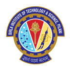

  

  <b>Software Development Engineer 2 @  Microsoft | Ex- Amazon, Ex- Razorpay</b> 
  Distributed Systems • Cloud Infrastructure • High-Throughput Ingestion • Search Infrastructure • Cost Engineering

  
  
  

---

## 🧠 Engineering Summary

I design and operate distributed systems that sustain high-throughput workloads under unpredictable traffic while maintaining availability and cost efficiency.

Currently working as an **SDE 2 (L62) at Microsoft**, building scalable cloud infrastructure and services. Previously part of the indexing charter for **Amazon OpenSearch Serverless (AWS)** — building infrastructure powering vector search and large-scale search workloads.

I focus on:
- Throughput-aware scaling
- Backpressure & flow control
- Observability-first architecture
- Failure-mode resilience
- Cost predictability at scale

---

## 🚀 Production Ownership

###  Microsoft — Software Development Engineer 2 (L62)

- Building scalable cloud infrastructure and services at Microsoft
- Applying distributed systems expertise to large-scale product engineering
- Driving system design, performance optimization, and reliability improvements

---

###  Amazon — OpenSearch Serverless (Previous)

**Scalability & Control**
- Designed and implemented internal **Index Rollover API** enabling ingestion auto-scaling
- Built controlled backpressure mechanism → reduced availability drops by **90%**
- Led 5TB+ ingestion benchmarking to identify system bottlenecks

**Observability & Reliability**
- Designed telemetry for ingestion, shard recovery, flush & refresh metrics
- Built dashboards for vector search indices (LLM embedding workloads)
- Improved signal-to-noise ratio in operational alerts

**Business & Customer Impact**
- Resolved 100+ high-severity performance escalations
- Onboarded major enterprise customer → **+$2M/month revenue**
- Mitigated cost anomaly → **$8.7M reduction in customer billing**

---

###  Razorpay — Backend Engineer (Previous)

- Designed backend for high-throughput tax payment workflows → **₹6.4 Crore launch month revenue**
- Owned payout-links microservice as SME
- Fixed state inconsistency bug preventing **₹4 Crore financial exposure**

---

## ⚙️ Technical Depth

**Core**
- Java
- Golang
- C#
- .NET
- Distributed system design
- AWS & Azure infrastructure

**Secondary**
- C++
- Python
- Docker
- Kubernetes
- GraphQL

---

## 🔬 Systems Interests

- Flow control algorithms in ingestion-heavy systems  
- Vector indexing for large-scale embedding workloads  
- Cost-aware distributed architecture  
- Lucene internals & indexing pipelines  
- Benchmarking & load simulation frameworks  

---

## 🛠️ Personal Projects

### [whoop-mcp](https://github.com/shashankswe2020-ux/whoop-mcp)
MCP server to connect to the WHOOP API. Built with TypeScript, it enables seamless integration with WHOOP's health and fitness data through the Model Context Protocol. Use can add it as connector in claude desktop too

<table>
  <tr>
    <td></td>
    <td></td>
    <td></td>
  </tr>
</table>

### [backend-pro-max-skill](https://github.com/shashankswe2020-ux/backend-pro-max-skill)
Staff-Engineer-in-a-Box: curated, BM25-searchable backend & distributed-systems intelligence across 20 domains and 12 language stacks — drop it into Claude Code, Cursor, Copilot, or any AI assistant.

<table>
  <tr>
    <td></td>
    <td></td>
  </tr>
</table>

### [research-buddy](https://github.com/shashankswe2020-ux/research-buddy)
AI-powered research paper agent that orchestrates spec-driven development, planning, code review, documentation, and shipping — all through a multi-agent architecture built for end-to-end research workflows.

<table>
  <tr>
    <td></td>
    <td></td>
  </tr>
</table>

---

## 🏆 Competitive Programming

- CodeChef — 2050 (5★)
- Codeforces — 1618 (Expert)
- Google Code Jam Round 2
- Facebook Hacker Cup Round 1

Strong algorithmic foundation complements production systems work.

---

## 🎓 Education

 &nbsp; B.E., Birla Institute of Technology & Science, Pilani (2020)

---

## 📌 Engineering Philosophy

Design for failure.  
Measure before optimizing.  
Scale deliberately — not accidentally.

  <i>Impact-driven distributed systems engineering.</i>

