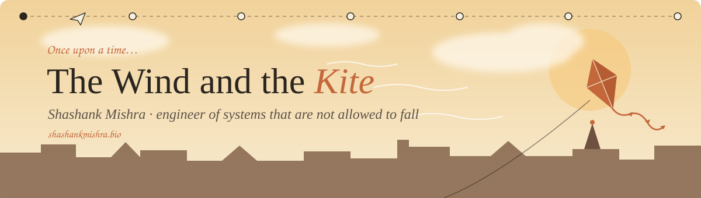
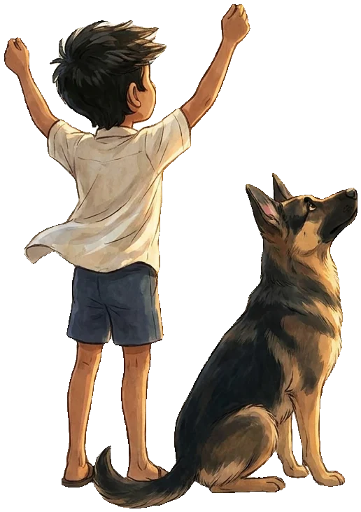
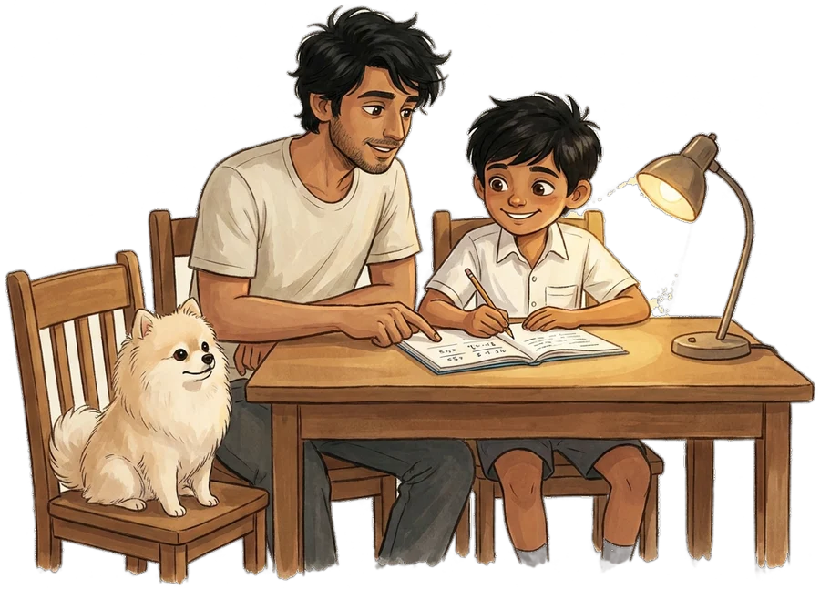
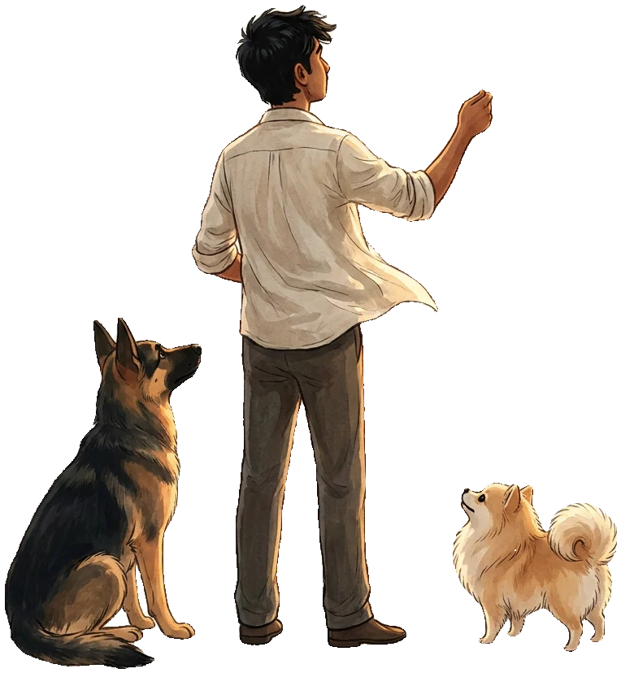

<p align="center">
  <a href="https://shashankmishra.bio"></a>
</p>

<p align="center">
  
</p>

<h3 align="center"><i>The boy who drew gods and built machines</i></h3>

<p align="center">
  <b>Software Engineer II @  Microsoft</b> · before that
   AWS,
   Razorpay and Publicis Sapient
</p>

<p align="center">
  <a href="https://shashankmishra.bio"></a>
  <a href="mailto:shashank.swe.2020@gmail.com"></a>
  <a href="https://www.linkedin.com/in/shashank-mishra-015a2b116/"></a>
  <a href="https://www.youtube.com/@AskEuler"></a>
  <a href="https://github.com/shashankswe2020-ux"></a>
</p>

<p align="center"><sub><i>A story about a star drawn on a cheek, and everyone who kept the kite flying.</i></sub></p>

---

<table>
<tr>
<td width="62%" valign="top">

### I · The 4 a.m. train
<sub><i>Every day, his father worked so his son could study.</i></sub>

My father had a degree in mathematics and caught the 4 a.m. train so I could go to the best school in the city. When the class laughed at the boy who wanted to be M.F. Husain, a teacher drew a little star on my cheek and said:

> *“Always believe in your dreams.”*

I kept drawing, kept filling registers with maths, took a drop year solving Irodov for the joy of it, and got into **BITS Pilani**.

</td>
<td width="38%" align="center" valign="middle">
  <br/>
  <sub><i>the star</i></sub>
</td>
</tr>
</table>

### II · First flight
<sub><i>One day, the boy took his first flight.</i></sub>

```
✈ DEL → GOI · S. Mishra · 2016 │ BITS ’16
```


- **B.E., BITS Pilani (Goa), 2020** — a rank list picked my branch; curiosity picked everything else
- Ran quantum circuits on a real IBM quantum computer from my hostel room
- Asked, every semester, until the machine learning course opened to **every branch**
- **CodeChef 2050 (5★, global rank 150)** · **Codeforces 1618 (Expert)** · Google Code Jam Round 2 · Facebook Hacker Cup Round 1

### III · Fireflies
<sub><i>But then, the wind changed.</i></sub>

In my final year my father passed away, at the peak of COVID. I set research aside, took the internship whose stipend could carry the family, and learned what he had already shown me: *strength isn't avoiding struggle; it's carrying it with grace.*

---

## IV · The big machines
<sub><i>Because of that, he learned to fly the big machines — systems that carry other people's money and data.</i></sub>

> **Design for failure. Measure before optimizing. Scale deliberately — not accidentally.**

#### 📓 The logbook

| | |
| --- | --- |
| <br/><sub>**now**</sub> | **Microsoft — Software Engineer II.** Building cloud infrastructure and services at scale; system design, performance and reliability. |
| <br/><sub>**AWS**</sub> | **Amazon OpenSearch Serverless — indexing write path.** Built the **Index Rollover API** that lets ingestion scale automatically. Caught a per-shard metadata call before launch and pushed for the fix. Stayed with a five-person team to stabilise it: availability in major US regions rose from dips as low as **40% to over 90%**. Controlled backpressure cut availability drops by **90%**; led 5TB+ ingestion benchmarks; built telemetry for ingestion, shard recovery, flush/refresh and vector indices. Fixed a cost anomaly worth **$8.7M** in customer billing, onboarded a **$2M/month** customer, resolved 100+ high-severity escalations, 300+ code reviews, mentored an intern to a full-time offer. |
| <br/><sub>**Razorpay**</sub> | **Startup speed.** Launched Advance Tax Payments in three months → **₹6.4 Cr** in its first month. Owned the payout-links service as SME; fixed a state-inconsistency bug that could have cost **₹4 Cr**. |
| <sub>**Sapient**</sub> | **First job.** Built a GraphQL layer that made a financial-wellness platform more responsive. Joined after a face-recognition internship; won the Learning Mindset award. |

#### 🧰 On the workbench

<p>
  
</p>

**Core:** Java · Golang · C# · .NET · distributed system design · AWS & Azure infrastructure
**Also:** C++ · Python · Docker · Kubernetes · GraphQL

**Wind I like to study:** flow control in ingestion-heavy systems · vector indexing for embedding workloads · cost-aware architecture · Lucene internals · benchmarking & load simulation

---

## V · The workshop
<sub><i>Because of that, he started building his own. The hangar light stays on late. All open source.</i></sub>

<table>
<tr>
<td width="33%" valign="top">

#### 📐 [WHOOP Connector](https://whoopconnector.com/)
Lets your AI assistant read your WHOOP recovery, sleep and strain. Read-only, your tokens stay on your machine, and you're compared against your own baseline.

<sub>`7,946 downloads · 166 stars · 16 tools`</sub><br/>
<sub>[source →](https://github.com/shashankswe2020-ux/whoop-mcp)</sub>

</td>
<td width="33%" valign="top">

#### 📐 [Backend Pro Max](https://backendpro.cc/)
A staff engineer in a box: 685 backend and distributed-systems concepts across 35 domains, each with a source, searchable by Claude, Cursor or Copilot before they design.

<sub>`685 concepts · 35 domains · 652 tests`</sub><br/>
<sub>[source →](https://github.com/shashankswe2020-ux/backend-pro-max-skill)</sub>

</td>
<td width="33%" valign="top">

#### 📐 [RigSpark](https://www.rigspark.si/)
Tells you which local AI models your machine can actually run before you download them: yes, slow or no, with estimated tokens per second. Never touches the network.

<sub>`69 models · 4 runtimes · 0 network calls`</sub>

</td>
</tr>
</table>

<details>
<summary><b>More from the workbench</b></summary>

#### [research-buddy](https://github.com/shashankswe2020-ux/research-buddy)
AI research-paper agent that orchestrates spec-driven development, planning, code review, documentation and shipping through a multi-agent architecture.

<table>
  <tr>
    <td></td>
    <td></td>
    <td></td>
  </tr>
</table>

</details>

---

## VI · Deliveries
<sub><i>Until finally, he was the one drawing the stars.</i></sub>

<table>
<tr>
<td width="45%" align="center" valign="middle">
  
</td>
<td width="55%" valign="top">

The star faded from my cheek, but its lesson didn't: the right encouragement at the right moment can rewrite someone's future.

| | |
| --- | --- |
| **∑** | [**Ask Euler**](https://www.youtube.com/@AskEuler) — one Project Euler problem at a time: the naive approach, then the trick |
| **20+** | free one-on-one calls with students breaking into software, since 2021 |
| **13k** | followers on LinkedIn, reading about non-linear careers |
| **1** | course opened to every branch |

</td>
</tr>
</table>

---

<p align="center">
  
</p>

<h3 align="center"><i>“Le vent se lève! … il faut tenter de vivre.”</i></h3>
<p align="center"><sub>The wind is rising; we must try to live. · Paul Valéry, the line that opens <i>The Wind Rises</i></sub></p>

<p align="center">
  The star faded. The kite is still up.<br/>
  <i>Win one day at a time.</i>
</p>

<p align="center">
  <b>Say hello</b> · <a href="mailto:shashank.swe.2020@gmail.com">shashank.swe.2020@gmail.com</a> · <a href="https://www.linkedin.com/in/shashank-mishra-015a2b116/">LinkedIn</a> · <a href="https://www.youtube.com/@AskEuler">Ask Euler</a> · <a href="https://shashankmishra.bio">shashankmishra.bio</a>
</p>

---

<details>
<summary><b>🪁 About the site</b></summary>

[shashankmishra.bio](https://shashankmishra.bio) is a single scrolling picture book built on Pixar's story spine — *Once upon a time → Every day → One day → But one night → Because of that ×2 → Until finally → And every day since.*

| Piece | What it is |
| --- | --- |
| [`/site`](./site) | Vite + vanilla JS, inline SVG + canvas, zero runtime dependencies |
| One wind field | `wind(t)` drives the kite, tail, string sag, grass, sea, smoke, clouds, fireflies and letters; scrolling gusts it |
| [`/design`](./design) | Prototype, Blender-rendered textures (`blender/scene.py`), character plates and the original score |
| Hosting | GitHub Pages via `.github/workflows/deploy-site.yml`; DNS on Hostinger |

Respects `prefers-reduced-motion`; music plays only when you tap the record.

```bash
cd site && npm install && npm run dev
```

See [`site/README.md`](./site/README.md) for build & deployment details.

</details>

<p align="center"><sub>drawn, written and engineered by hand</sub></p>

<p align="center">
  
</p>
